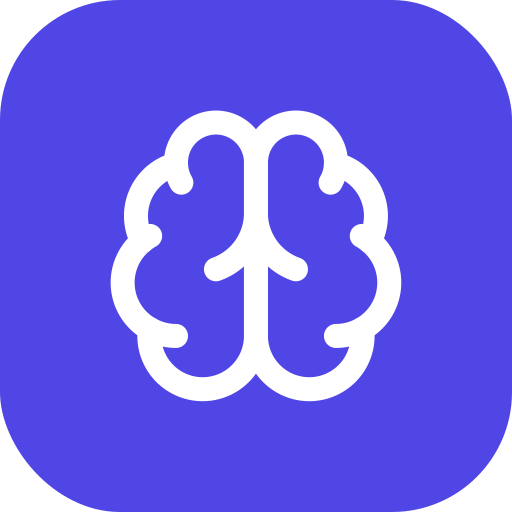

<div align="center">



# STEM-ED-AI

### AI-Native Education Operating System by SERA Neural Labs

[](https://nextjs.org)
[](https://www.typescriptlang.org)
[](https://tailwindcss.com)
[](LICENSE)
[](https://studentprivacy.ed.gov)
[](https://vercel.com)

[](https://github.com/peddapudisiva/stem-ed-ai)
[](CONTRIBUTING.md)
[](https://ui.shadcn.com)
[](https://www.framer.com/motion)

**Pilot institutions: Atlanta Technical College (ATC) · Georgia Southern University (GSU)**

[Live Demo](#) · [Report Bug](https://github.com/peddapudisiva/stem-ed-ai/issues) · [Request Feature](https://github.com/peddapudisiva/stem-ed-ai/issues)

</div>

---

## Overview

STEM-ED-AI is a full-stack enterprise EdTech SaaS platform built to improve student retention, streamline curriculum governance, and deliver AI-powered learning at scale. It is designed to look and feel like a $50M-funded product — because the students and educators using it deserve nothing less.

Built with **Next.js 16 App Router**, **TypeScript strict mode**, **Tailwind CSS v4**, and a suite of 10 specialized AI agents, STEM-ED-AI covers everything from student gamification to federal GovCon compliance.

---

## Screenshots

| Student Dashboard | AI Tutor | Admin Reports |
|---|---|---|
|  |  |  |

---

## Features

### 8 Role-Based Dashboards
| Role | Key Features |
|------|-------------|
| 🎓 **Student** | Courses, AI Tutor, timed quizzes, badges/credentials, NABA mentor matching |
| 👩‍🏫 **Teacher** | Gradebook, attendance, file management, AI lesson generator |
| 🏫 **Admin** | Student directory, faculty PD tracker, reports, multi-tenant management |
| 🏛️ **District Leader** | SKORA retention analytics, school comparison, GovCon pipeline |
| 📋 **Curriculum Committee** | Proposal workflow, eCatalog, AI curriculum assistant |
| 🌐 **GovCon** | SAM.gov mock, RFP pipeline, compliance tracking |
| 🔒 **IT / Cyber** | NIST RMF score, FERPA compliance, audit log |
| 👨‍👩‍👧 **Parent** | Child overview, teacher messaging, fee status |

### 10 AI Agents (Boundaries Enforced)
| Agent | Role | Boundary |
|-------|------|----------|
| Tutor Agent | Personalized 1:1 learning | Never grades work |
| Teacher Assistant | Reduce teacher workload | Never makes final grade decisions |
| Curriculum Architect | Standards-aligned curriculum | Never personalizes to individuals |
| Assessment Builder | Generate & score assessments | Never determines final grades |
| District Analyst | Executive KPI intelligence | Read-only, no actions |
| GovCon Intel | Federal RFP tracking | Never submits proposals |
| RAG Knowledge | Institutional memory retrieval | Retrieval only |
| Workflow Orchestrator | Cross-system orchestration | Executes defined logic only |
| Reporting Engine | Compliance report generation | Summarizes only |
| Compliance Guard | FERPA, CMMC, 508 monitoring | Flags only, never auto-remediates |

### Platform Highlights
- ⚡ **Cmd+K Command Palette** — Linear-style global search
- 🔔 **Smart Notification Center** — Real-time slide-out drawer
- 🎮 **Gamification** — XP, levels, streaks, badges, leaderboard
- 📅 **Unified Calendar** — Month/Week/Agenda views, Google & Outlook sync
- 📱 **Mobile PWA** — Bottom tab navigation, swipe gestures, offline support
- 🧩 **Custom Dashboard Builder** — Drag-and-drop widget layout
- 🔐 **Security** — 2FA (TOTP), SAML SSO (Okta/Azure AD), session management, IP allowlist
- 🏢 **Multi-Tenancy** — FERPA-isolated per institution via Supabase RLS
- 🔌 **Integrations Hub** — Banner SIS, Canvas, Google Workspace, webhooks
- 📊 **Advanced Reports** — Compliance builder, PDF export, saved reports

---

## Tech Stack

| Layer | Technology |
|-------|-----------|
| **Framework** | Next.js 16 (App Router) + TypeScript strict |
| **Styling** | Tailwind CSS v4 + shadcn/ui (New York) |
| **Animation** | Framer Motion 12 |
| **State** | Zustand 5 + TanStack Query v5 |
| **Forms** | React Hook Form + Zod |
| **Charts** | Recharts |
| **Auth** | Supabase Auth (Google SSO + email + SAML) |
| **Database** | Supabase (PostgreSQL + Row Level Security) |
| **Storage** | Supabase Storage |
| **AI / LLM** | Groq API (Llama 3.1) + Ollama fallback |
| **Vector DB** | Qdrant |
| **Deployment** | Vercel (frontend) + Railway (backend) |
| **Icons** | Lucide React |

---

## Getting Started

### Prerequisites
- Node.js 20+
- npm or pnpm

### Installation

```bash
# Clone the repository
git clone https://github.com/peddapudisiva/stem-ed-ai.git
cd stem-ed-ai

# Install dependencies
npm install

# Copy environment variables
cp .env.example .env.local

# Start the development server
npm run dev
```

Open [http://localhost:3000](http://localhost:3000) in your browser.

### Environment Variables

```env
# Supabase
NEXT_PUBLIC_SUPABASE_URL=your_supabase_url
NEXT_PUBLIC_SUPABASE_ANON_KEY=your_supabase_anon_key
SUPABASE_SERVICE_ROLE_KEY=your_service_role_key

# AI
GROQ_API_KEY=your_groq_api_key

# Auth
NEXTAUTH_SECRET=your_nextauth_secret
NEXTAUTH_URL=http://localhost:3000
```

---

## Project Structure

```
stem-ed-ai/
├── app/
│   ├── (auth)/          # Login, signup
│   ├── dashboard/       # All 8 role dashboards
│   ├── settings/        # Profile, security, billing, etc.
│   ├── calendar/        # Unified calendar
│   ├── messages/        # Messaging system
│   ├── assistant/       # Multi-agent AI workspace
│   └── help/            # Help center
├── components/
│   ├── layout/          # AppShell, Sidebar, Topbar
│   ├── dashboard/       # Reusable dashboard widgets
│   └── ui/              # shadcn/ui + custom components
├── lib/
│   ├── demo-data.ts     # All seed data
│   └── copy.ts          # UI string constants
└── public/              # Assets, PWA icons, manifest
```

---

## Security & Compliance

- 🔒 **FERPA** — Student data never crosses institutional boundaries (Supabase RLS)
- 🔐 **Encryption** — AES-256 at rest, TLS in transit
- 🛡️ **2FA** — TOTP-based two-factor authentication
- 🏢 **SAML SSO** — Okta, Azure AD, Google Workspace
- 📋 **Audit Log** — Every agent action and admin operation logged
- 🚫 **No hardcoded secrets** — All credentials via environment variables

---

## Roadmap

- [ ] FastAPI backend with Groq LLM integration
- [ ] Live Supabase auth + RLS policies
- [ ] Stripe billing integration
- [ ] Real-time messaging via Supabase Realtime
- [ ] Qdrant vector search for RAG
- [ ] IPEDS & SACSCOC report exports
- [ ] Mobile app (React Native)

---

## Contributing

Contributions are welcome! Please read the [Contributing Guide](CONTRIBUTING.md) first.

```bash
# Create a feature branch
git checkout -b feature/amazing-feature

# Commit your changes
git commit -m "Add amazing feature"

# Push and open a PR
git push origin feature/amazing-feature
```

---

## License

Distributed under the MIT License. See [LICENSE](LICENSE) for more information.

---

## Contact

**SERA Neural Labs**
- Email: support@seratrust.org
- GitHub: [@peddapudisiva](https://github.com/peddapudisiva)

---

<div align="center">

Built with ❤️ for students, educators, and institutions that deserve better tools.

**SERA Neural Labs · FERPA Compliant · SOC 2 Type II In Progress**

</div>
